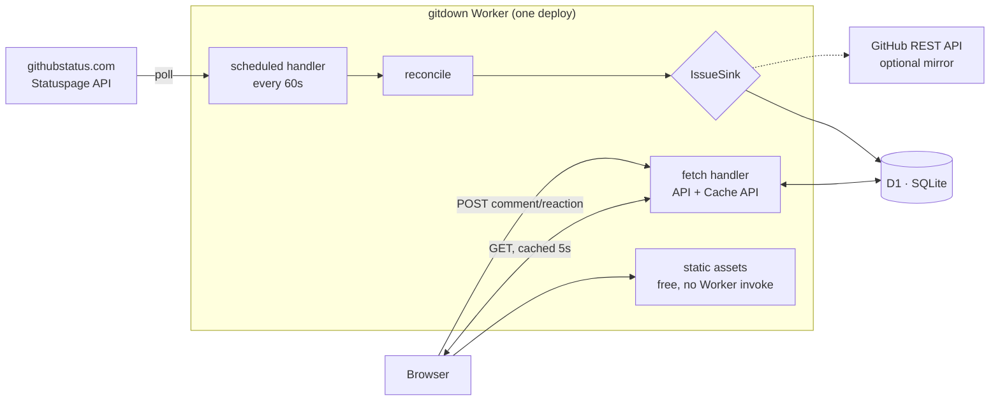

# gitdown — Build Spec

## 1. What this is

A parody of the GitHub Issues UI that turns **GitHub's own status page into a conversational feed**.

An ingestion service watches [githubstatus.com](https://www.githubstatus.com). When GitHub opens an incident, gitdown opens a corresponding issue. Each official incident update becomes a bot comment on that issue's timeline. When GitHub resolves the incident, the issue closes.

Meanwhile, anonymous visitors do the thing people actually want to do during an outage: pile into the thread, comment, and react.

Two halves, deliberately decoupled:

| | Ingestion (write, machine) | Interaction (read+write, human) |
|---|---|---|
| Source | githubstatus.com API | Browser |
| Volume | ~1 req/min, tiny | Spiky, potentially huge |
| Authority | Only the bot writes issues | Only humans write comments/reactions |
| Failure mode | Stale issue list | Read-only site |

Humans never create or close issues. The bot never comments as a human. That separation keeps the permission model trivial — there is no "who may close this issue" question to answer.

---

## 2. The defining constraint: traffic is perfectly correlated with outages

This is the single most important fact about the system, and the previous spec didn't account for it.

Baseline traffic is approximately zero. Traffic during a major GitHub incident is *whatever the internet feels like sending*, arriving in minutes, with no warmup. The site is only interesting when GitHub is broken, so **every design decision should optimize for a cold 0-to-viral spike**, not for steady-state throughput.

Consequences that drive the rest of this document:

1. **No always-on capacity.** Scale-to-zero or it costs money 99% of the time for nothing. (Workers/D1 qualify.)
2. **Reads must be cacheable at the edge.** A spike is overwhelmingly people *watching* one hot issue. If each viewer's poll reaches the database, the bill and the latency both scale with viewers. They must not.
3. **Reads must not depend on the write path.** If comment writes fall over under load, the site must degrade to a read-only outage feed, not a 500 page.
4. **Nothing on the critical path may be hosted on GitHub.** See §11.
5. **Capacity you can't test is capacity you don't have.** The spike arrives unannounced; load-test before shipping (§13).

---

## 3. Architecture

**One Cloudflare Worker is the entire backend.** It serves the static frontend, the API, and the cron-driven ingestion — one project, one deploy, one domain.



**Ingestion is one cron trigger, not a worker pool.** Statuspage incidents update on the order of minutes; a single Cloudflare Cron Trigger at `* * * * *` (the minimum interval) is sufficient and inherently avoids the double-write races a pool would create. The optional webhook exists only to cut latency from ~60s to ~2s.

**No separate Pages project.** Workers serve static assets natively, and requests that match a static file **never invoke Worker code and are never billed**. Splitting the frontend into its own Pages project would add a second deploy target and cross-origin routing for no benefit.

**No queue at launch.** See §9.2 — writes go straight to D1. The queue remains specified as a scale lever, not a launch requirement.

---

## 4. Ingestion: status page → issues

### 4.1 Source endpoints (verified live)

| Endpoint | Use |
|---|---|
| `/api/v2/summary.json` | Everything at once: page, components, unresolved incidents, maintenances. **Primary poll target.** |
| `/api/v2/incidents.json` | Last ~50 incidents including resolved. Used for backfill and resolution catch-up. |
| `/api/v2/scheduled-maintenances.json` | Maintenance windows (optional, see §4.6) |
| `/history.atom` | Deep history for one-time seeding |

Poll `summary.json` — one request covers the live state. `page.updated_at` gives a cheap global change check: if it hasn't moved since last sync, do nothing and write no rows.

### 4.2 Verified payload shape

Incident fields: `id`, `name`, `status`, `impact`, `shortlink`, `created_at`, `updated_at`, `started_at`, `monitoring_at`, `resolved_at`, `page_id`, `incident_updates[]`, `components[]`.

Incident update fields: `id`, `status`, `body`, `incident_id`, `created_at`, `updated_at`, `display_at`, `affected_components[]`, `deliver_notifications`, `custom_tweet`, `tweet_id`.

`affected_components[]` entries: `code`, `name`, `old_status`, `new_status` — this is what powers "Actions went from operational to major_outage" timeline events.

Enumerations:
- `incident.status`: `investigating` → `identified` → `monitoring` → `resolved` (also `postmortem`)
- `incident.impact`: `none` | `minor` | `major` | `critical`
- component status: `operational` | `degraded_performance` | `partial_outage` | `major_outage`

**Gotcha:** the component list includes a sentinel that is not a real component — `"Visit www.githubstatus.com for more information"` (id `0l2p9nhqnxpd`). Filter it out by id or it becomes a nonsense label on every issue.

### 4.3 The reconcile function

One pure-ish function, called identically by cron and by webhook. This is what makes the two paths safe to run concurrently.

```
reconcile():
  summary = GET /api/v2/summary.json
  if summary.page.updated_at == sync_state.last_seen: return   # no-op, no writes
  incidents = summary.incidents ∪ (recently-resolved from incidents.json)

  for incident in incidents:
    issue = SELECT * FROM issues WHERE incident_id = incident.id
    if not issue:
      issue = openIssue(incident)                    # → 'opened' timeline event
    else if issue.src_updated_at == incident.updated_at:
      continue                                       # untouched, skip cheaply

    diff(issue, incident) → emit timeline events:
      title changed         → 'renamed'
      impact changed        → 'label_removed' + 'label_added'
      new incident_update   → 'status_update' (bot comment)
      component transitions → 'component_changed'
      status → resolved     → 'closed'
      resolved → un-resolved→ 'reopened'

  sync_state.last_seen = summary.page.updated_at
```

**Idempotency is by upstream ID, not by ordering.** Every timeline row carries the Statuspage `incident_update.id` as its unique `id`; every issue carries the `incident.id`. All writes are `INSERT ... ON CONFLICT DO UPDATE`. Running reconcile twice concurrently produces the same result as running it once. This is what lets the webhook and cron coexist without locking.

### 4.4 The webhook is untrusted input

Statuspage lets subscribers register a webhook URL, and it **does not sign its payloads** — there is no documented HMAC or shared-secret verification. Anyone who learns the URL can POST arbitrary JSON claiming GitHub is on fire.

So: **never read data out of the webhook body.** The handler validates nothing, stores nothing, and simply triggers `reconcile()`, which re-fetches from the authoritative API over TLS. The body is a nudge, not a source.

Also give the endpoint an unguessable path, rate-limit it hard (it should fire a handful of times an hour at most), and debounce it — collapse bursts into at most one reconcile every ~5s.

This also neutralizes the content-injection angle: incident text is rendered into a public feed, so it must be treated as untrusted regardless of path (§10.3).

### 4.5 Mapping

| Incident concept | gitdown concept |
|---|---|
| Incident | Issue (auto-numbered `#N`) |
| `incident.name` | Issue title |
| `status` ∈ investigating/identified/monitoring | State: **open** |
| `status` ∈ resolved/postmortem | State: **closed** |
| `impact` | Label: `impact:critical` `#d1242f` · `impact:major` `#bc4c00` · `impact:minor` `#bf8700` · `impact:none` `#6e7781` |
| Affected components | Labels (`Actions`, `Git Operations`, `Copilot`, …) |
| Each `incident_update` | Bot comment from `githubstatus` with a status chip |
| `affected_components[].old→new` | Timeline event row |
| `shortlink` | "View on githubstatus.com" link in sidebar |

The mapping is a gift: impact escalation genuinely renders as *"githubstatus added the `impact:critical` label"*, and a retitled incident renders as *"githubstatus changed the title"* — real GitHub timeline furniture, generated for free by the diff.

### 4.6 Edge cases to handle

- **Operators edit update bodies after posting.** Upsert on `incident_update.id`, set `edited_at`, render GitHub's "edited" marker.
- **Operators delete updates.** An update present last sync and absent now → soft-delete (`deleted_at`), don't hard-delete.
- **Incidents get un-resolved.** Rare, but the model supports it: emit `reopened`.
- **`incidents.json` only returns ~50.** A long-resolved incident can fall off the list before you see the resolution if ingestion is down for a long stretch. On startup, run a wider reconciliation pass against `/history.atom`.
- **Backfill scope: the last ~7 days only**, seeded oldest-first so issue numbers ascend with time like a real repo. One call to `incidents.json`, filtered by date. Deep history is deliberately out of scope — the site is about *now*, and a long archive would undercut that. Note the consequence: GitHub is usually fine, so **launch day may well show an empty issue list**, which makes the empty state (§12) load-bearing from day one rather than a nicety.
- **Maintenance windows.** `scheduled` / `in_progress` / `verifying` → open; `completed` → closed; label `maintenance`. Recommend deferring to v2 — they're not funny and they'd dilute the feed.
- **Clock/timezone.** Statuspage emits ISO-8601 UTC (`page.time_zone: "Etc/UTC"`). Store all times as integer epoch ms; format relative times client-side.

---

## 5. The sink interface (and the GitHub-native PoC)

Ingestion targets an interface, not a database:

```ts
interface IssueStore {
  loadByIncidentId(incidentId: string): Promise<StoredIssue | null>
  apply(change: IssueChange): Promise<void>
  getSyncState(key: string): Promise<string | null>
  setSyncState(key: string, value: string): Promise<void>
}
```

**Implementation note (revised during step 2).** This originally specified granular methods — `openIssue`, `addUpdate`, `setLabels`, `rename`, `closeIssue`, `reopenIssue`. The built version instead has `diffIncident()` compute a **change set** (`append` / `amend` / `remove` / `patch`) which the store applies in one call. Two reasons: computing what changed is pure and applying it is I/O, so the entire diffing behaviour is testable with no database at all; and a backend applies one change set in one transaction rather than being driven through six calls it must stitch together atomically. Granular sinks remain expressible — `GitHubSink` just translates a change set into REST calls.

**`GitHubSink`** — posts to the real `gitdown` repo via the REST API as a bot (fine-grained PAT or GitHub App, `issues: write`). ~150 lines. Build this **first**: it proves the poller, the diffing, and the idempotency logic end-to-end in an afternoon, against a UI you don't have to build. Keep it afterward as a mirror and durable archive.

**`D1Sink`** — the real product. Same calls, writes to D1.

Its known limits, so you're not surprised: the GitHub-native version can't do reactions-on-comments the way you want, can't style anything, and — decisively — **breaks during exactly the outages it exists to cover**, since `Issues` and `API Requests` are both status-page components. Treat it as scaffolding and a mirror, not a destination. Ingestion should also queue-and-retry on `GitHubSink` failures rather than dropping updates, precisely because it will be failing when it matters.

---

## 6. Data model (D1 / SQLite)

```sql
CREATE TABLE issues (
  number         INTEGER PRIMARY KEY AUTOINCREMENT,  -- the #N in the UI
  incident_id    TEXT UNIQUE,               -- Statuspage id; NULL for hand-authored
  title          TEXT    NOT NULL,
  state          TEXT    NOT NULL,          -- open | closed
  impact         TEXT    NOT NULL,          -- none | minor | major | critical
  status         TEXT    NOT NULL,          -- investigating | identified | monitoring | resolved
  shortlink      TEXT,
  components     TEXT    NOT NULL DEFAULT '[]',  -- JSON array of component names
  comment_count  INTEGER NOT NULL DEFAULT 0,     -- denormalized, see §7.2
  reactions      TEXT    NOT NULL DEFAULT '{}',  -- denormalized counts
  started_at     INTEGER NOT NULL,
  resolved_at    INTEGER,
  created_at     INTEGER NOT NULL,
  updated_at     INTEGER NOT NULL,
  src_updated_at INTEGER                    -- incident.updated_at, for the cheap skip
);

-- Bot events and human comments share one table: one query per render,
-- one monotonic cursor for polling, guaranteed-stable ordering.
CREATE TABLE timeline (
  seq        INTEGER PRIMARY KEY AUTOINCREMENT,  -- the polling cursor
  id         TEXT    NOT NULL UNIQUE,   -- incident_update.id, or uuid for user content
  issue_num  INTEGER NOT NULL REFERENCES issues(number),
  kind       TEXT    NOT NULL,  -- opened|status_update|comment|component_changed
                                -- |label_added|label_removed|renamed|closed|reopened
  actor      TEXT    NOT NULL,  -- 'githubstatus' for bot, else session_id
  body       TEXT,              -- markdown (status update text or user comment)
  meta       TEXT,              -- JSON: {status, component, from, to, label, ...}
  reactions  TEXT    NOT NULL DEFAULT '{}',  -- {"+1":12,"eyes":3}
  created_at INTEGER NOT NULL,
  edited_at  INTEGER,
  deleted_at INTEGER
);
CREATE INDEX idx_timeline_issue_seq ON timeline(issue_num, seq);

CREATE TABLE sessions (
  session_id   TEXT PRIMARY KEY,
  token_hash   TEXT    NOT NULL,   -- SHA-256 of the client's secret, see §8
  display_name TEXT,
  created_at   INTEGER NOT NULL,
  post_count   INTEGER NOT NULL DEFAULT 0,
  blocked_at   INTEGER
);

-- Dedupe only. Never read on the render path (§7.2).
CREATE TABLE reactions (
  target_id  TEXT    NOT NULL,   -- timeline.id, or 'issue:123'
  session_id TEXT    NOT NULL,
  emoji      TEXT    NOT NULL,
  created_at INTEGER NOT NULL,
  PRIMARY KEY (target_id, session_id, emoji)
) WITHOUT ROWID;

CREATE TABLE sync_state (key TEXT PRIMARY KEY, value TEXT NOT NULL);
```

### Two decisions worth defending

**Unified `timeline` table.** Bot events and user comments interleave chronologically in the UI. Keeping them in separate tables means two queries and a merge on every render, and no single cursor. One table gives you `WHERE issue_num = ? AND seq > ?` — an indexed range scan that returns *only new rows*. On a read-heavy, poll-driven site billed per row read, this is the highest-leverage choice in the schema.

**Order by `seq`, not `created_at`.** The cursor must be exact and the feed must be append-only: a viewer who has seen up to `seq=N` should never have anything appear *above* what they already have. `seq` guarantees that by construction; `created_at` does not, because insertion order and timestamp order can diverge — under clock skew, under retry, and especially if writes are ever moved behind a queue (§9.2). Backfill also inserts bot events for an incident whose updates are timestamped in the past. `created_at` is only ever used to render "3 minutes ago".

---

## 7. Read path — where the money goes

### 7.1 Edge caching is the whole ballgame

During a spike, nearly every request is a poll for one hot issue. Uncached, 50k viewers polling every 5s is ~600k req/min into D1. Cached for 5 seconds, it's ~1 D1 read per 5s per colo — **the D1 load stops scaling with viewer count entirely.**

Inside the Worker, before touching D1:

```js
const cache = caches.default;
let res = await cache.match(req);
if (res) return res;                       // never reaches D1
res = await buildFromD1(req);
res.headers.set('Cache-Control', 'public, max-age=5');
ctx.waitUntil(cache.put(req, res.clone()));
return res;
```

Be precise about what this does and doesn't save: a Worker route **always** invokes the Worker, so you still pay the Workers request (cheap, $0.30/M). What you eliminate is the D1 row reads and the query latency — which is the part that scales badly.

Layered on top:

- **Cursor polling.** `GET /api/issues/:n/timeline?since=<seq>` normally returns `{"events":[],"cursor":N}` — a few dozen bytes, trivially cacheable, zero rows read beyond the index probe.
- **ETag / 304.** Cursor value doubles as the ETag; unchanged polls return 304 with no body.
- **Closed issues are never polled at all** (§7.3). Only the one live issue generates poll traffic.
- **Client backoff.** 5s when the tab is visible and the issue is open; **pause entirely on `document.visibilityState === 'hidden'`**. People leave outage tabs open for hours — this one line is a large fraction of total request volume.
- **Jitter.** ±20% on the interval, or every client that loaded during the spike polls in lockstep forever.

**Escape hatch if it ever gets truly viral:** have the cron worker write a static `issue-N.json` snapshot to R2/KV every 10s and serve reads straight from the CDN. Reads then cost nothing and don't invoke a Worker at all. Not needed at launch; know it's there.

### 7.2 Denormalize the counts

D1 bills **rows read**, which makes aggregates quietly expensive:

- `COUNT(*)` of comments per issue on the list page reads every comment row for every issue, on every render. → `issues.comment_count`, incremented by the queue consumer.
- Reaction counts via `GROUP BY` read every reaction row. → `reactions` JSON blob on the target row.

The `reactions` table is then touched only on write (for dedupe). "Which reactions did *I* leave?" is answered from `localStorage` — it's per-viewer decoration, not shared state, and it's fine if it's wrong on a new device.

### 7.3 Closed issues are immutable — and that's most of the site

Because a closed issue can never change again (§9.3), it can be cached effectively forever:

```
Cache-Control: public, max-age=31536000, immutable
```

The consequences compound:

- **Zero polling on closed issues.** The client checks state once and stops. There is no such thing as a slow poll on a dead thread.
- **At most one issue in the entire system is ever live.** GitHub usually has zero open incidents and rarely more than one. So the entire write path, the queue, and all uncacheable read traffic concentrate on a single row — everything else is static.
- **History is free.** Every past incident is born closed and immutable. Deep-linked old issues, crawlers, and the archive cost CDN hits and nothing else — which is why the archive can grow indefinitely even though launch only seeds a week of it (§4.6).
- **The escape hatch gets trivial.** Pre-rendering closed issues to static JSON in R2/KV (§7.1) stops being an emergency measure and becomes the obvious default: the cron worker writes each issue's final snapshot once, at close, and never touches it again.

This is worth stating plainly because it inverts the usual scaling worry: the archive grows without bound but costs nothing, and the expensive surface stays fixed at one issue no matter how long the site runs.

---

## 8. Identity

Unchanged in spirit from the original spec, with one fix.

On first visit the client generates `session_id` (UUID) **and a separate random `session_token`**, both in `localStorage`. It sends both; the server stores only `SHA-256(token)`.

The original spec flagged the impersonation hole as a known tradeoff and suggested this as a possible later addition. Do it now — it's about fifteen lines, it's very hard to retrofit once sessions exist in the wild, and a public site whose whole audience is developers *will* have someone poke at it within the hour.

- `session_id` is public (it appears in the feed as the comment author).
- `session_token` never leaves the client except over TLS and is never rendered.
- Name changes and comment edits/deletes require a matching token hash.
- Reserve `githubstatus`, `github`, and anything matching `/^github/i` as display names, or the bot is trivially impersonable in a thread about GitHub being broken.
- Avatars: deterministic identicons generated from `hash(session_id)`, drawn client-side. No external requests, no Gravatar.

This is still not authentication, and shouldn't be described as such. It stops casual impersonation, which is the actual threat here.

---

## 9. Write path

### 9.1 Endpoints

| Method | Path | Notes |
|---|---|---|
| `GET` | `/api/issues?state=open\|closed&page=N` | List. Cache 10s. |
| `GET` | `/api/issues/:n` | Issue + first page of timeline. Cache 5s. |
| `GET` | `/api/issues/:n/timeline?since=<seq>` | Poll. Cache 5s, ETag. |
| `POST` | `/api/issues/:n/comments` | `201` + created row. `409` if the issue is closed (§9.3). |
| `POST` | `/api/reactions` | Toggle. `409` if the issue is closed. |
| `PUT` | `/api/session/name` | Requires token. |
| `POST` | `/api/hooks/statuspage/<secret-path>` | Untrusted nudge (§4.4). |
| `POST` | `/api/admin/*` | Soft-delete, block session, kill switch. Workers Secret. |

### 9.2 Writes go directly to D1 (the queue is deferred)

The original spec put Cloudflare Queues on the write path to exploit the latency tolerance. That reasoning was sound, but §7.3 changed the premise: **at most one issue is ever live**, so the write path is inserts against a single hot issue, not a broad fan-out. Direct `INSERT`s to D1 are simpler, have fewer moving parts to operate, and remove the queue-lag complexity from the close race.

So at launch: validate → rate-limit → `INSERT` → return the created row. All writes go through one `writeComment()` / `applyReaction()` module so the implementation can be swapped without touching callers.

**Keep these two properties regardless of backend**, because they're what make the queue a drop-in later:

- **`created_at` is stamped at the edge**, on receipt, never at insert time.
- **The client renders its own comment optimistically and immediately**, greyed out until confirmed. Even at 50ms this is better UX, and it means adding queue lag later changes nothing user-visible.

**Add the queue when — and only when — load testing shows D1 write contention.** D1 is SQLite and serializes writes, so a genuine viral spike on one issue is the scenario that would force it. Trigger to watch: sustained write latency above ~200ms or visible `SQLITE_BUSY`. Cost was never the reason (1M ops/mo included, ~3 ops per message ≈ 330k comments); complexity was.

### 9.3 Lifecycle: a thread lives exactly as long as the incident

**Closed issues are not commentable.** No comments, no reactions, no name changes on anything already in them. The thread exists to be a place to complain while you can't do your job, and when the incident resolves the reason for it is gone. Closing is permanent and total: a closed issue is frozen, not merely read-only-by-convention.

Enforcement is server-side, in the consumer, not just a hidden composer in the UI.

**The close race matters.** Traffic peaks right as the incident resolves, so there will always be requests in flight when the issue closes. The rule:

- A comment is accepted if its **edge-stamped `created_at` precedes the close timestamp**. Dropping a comment someone watched themselves type — at the exact moment the thread is busiest — is the worst possible failure here.
- Anything stamped after the close is rejected with `409`, and the UI swaps the composer for the locked state.
- The accept/reject check and the close must be **decided against the same row**, i.e. the insert is conditional on the issue still being open (`INSERT ... SELECT ... WHERE state='open' OR ? < resolved_at`), not on a value read earlier in the request. Otherwise a read-then-write gap lets comments land in a closed thread.
- After close, hold a **60-second settling window** at normal cache TTLs before marking the issue immutable (§7.3) and writing its final static snapshot. An issue that went immutable with writes still in flight would strand them permanently. This window is what makes the queue safe to add later without revisiting the design.

`reopened` (§4.6) unfreezes an issue — rare, but the state machine must handle it, which is the other reason the immutability flag is derived at settle-time rather than assumed at close-time.

---

## 10. Abuse, moderation, safety

An unauthenticated public comment box that becomes popular during a stressful outage is going to get exactly what you'd expect. This needs to exist at launch, not after.

### 10.1 Rate limiting
Per `session_id` **and** per `CF-Connecting-IP` (session IDs are client-generated, so they're free to mint — IP is the real limit). Suggested: 1 comment / 10s, 20 / hour, 4000 char cap, 30 reactions / min. Cloudflare Rate Limiting Rules handle this at the edge before your Worker runs.

### 10.2 Bot mitigation
Cloudflare Turnstile on a session's first post, then trust the session. Free, and near-invisible for real users.

### 10.3 Rendering untrusted content
Both user comments *and* incident bodies are untrusted (§4.4). Render a restricted markdown subset — bold, italic, code, links, lists — then sanitize. **Never `innerHTML` raw input**; build DOM nodes or run output through a sanitizer. Force `rel="nofollow noopener"` on links. Note that incident text arrives from an external API and gets rendered into a page you serve: treat it as data to escape, never as markup to trust.

### 10.4 Moderation
- Soft-delete only (`deleted_at`), rendering as GitHub's "This comment was hidden".
- Denylist for slurs — it's a joke site, but a public feed carrying them is a real liability.
- **Kill switch**: a KV flag that disables posting site-wide while keeping the feed readable.
- Admin actions gated by a secret in Workers Secrets, never a client-side check.

### 10.5 Legal
- Prominent footer disclaimer: not affiliated with, endorsed by, or connected to GitHub or Microsoft.
- Don't ship GitHub's actual logo or Octocat — those are trademarks. The hand-built CSS approach in the README is already the right call; keep icons original.
- Incident text is GitHub's content. Quoting it is the entire point of the site and reads as fair-use commentary, but attribute clearly and link every issue back to its `shortlink`.
- Set a descriptive `User-Agent` on the poller with a contact URL. One request per minute to a public JSON endpoint is unobjectionable; be identifiable anyway.

---

## 11. Hosting and deployment

**Do not host any part of this on GitHub.** The site's peak traffic coincides precisely with GitHub being degraded:

- **GitHub Pages** — `Pages` is a status component. Your outage site goes down during outages.
- **GitHub Actions for deploys** — `Actions` is a status component. You lose the ability to ship a fix during the incident.
- **Container/package registries on GHCR** — same problem.

The distinction that matters: GitHub must not be a **runtime** dependency, and must not be the **only** way to ship a fix. Deploying *from* a GitHub repo is fine as long as there's a path that doesn't need it.

**Two deploy paths, both maintained:**

1. **Normal** — Cloudflare's Git integration watches the repo; `git push` to `main` builds and deploys. No GitHub Actions involved (Cloudflare pulls).
2. **Break-glass** — `npx wrangler deploy` from a laptop. Zero GitHub involvement.

**Operational rule: exercise path 2 on a schedule.** A break-glass path that only ever runs during an emergency will be broken during the emergency.

### 11.1 Domain

`gitdown.chat` is registered at GoDaddy. A Worker custom domain requires the domain to be an **active Cloudflare zone**, so:

- Keep registration at GoDaddy; change the **nameservers** to Cloudflare's.
- Cloudflare then provisions the DNS record and the SSL certificate automatically — no cert management.

### 11.2 Availability posture

Reads survive a total write-path failure. If D1 is unreachable, serve the last cached snapshot with a stale banner. Static assets are served without invoking the Worker at all, so the shell of the site survives even a Worker exception. The one unacceptable outcome is gitdown being down while GitHub is down.

---

## 12. Frontend

The existing static pages already carry the right components — `.timeline`, `.timeline-icon`, `.timeline-event-text`, `.timeline-comment`, `.reaction-pill`, `.label-chip`, `.state-badge`, `.role-pill` map onto this model almost one-to-one. `.role-pill` in particular is exactly the `bot` badge on `githubstatus` comments.

Built (step 5):
- Rendering from `/api/issues` + `/api/issues/:n`, Open/Closed tabs, pagination.
- Poll loop with visibility-pause and jitter; open issues only, since closed ones can never change.
- Locked-issue treatment (§9.3), shown to every visitor of a resolved incident.
- Bodies rendered without parsing untrusted HTML: everything is escaped into text nodes and the single allowed tag (`<br>`) is rebuilt as a real element. No sanitiser, so no parser to bypass.

Still needed (steps 6–7):
- Comment composer, reaction picker (the 8 GitHub reactions: 👍 👎 😄 🎉 😕 ❤️ 🚀 👀), display-name editor.
- Optimistic comment rendering.
- Genuine markdown for user comments — `marked` + `dompurify`. A different threat model from bot bodies; do not extend the escape-and-rebuild approach to cover it.
- Hashed asset filenames, replacing the README's manual `?v=N` discipline.

### 12.1 Joke surfaces

The point of this project is to be scaffolding for programming jokes, so the places designed to hold bits are part of the spec, not decoration. Keeping them listed means the build leaves the seams in the right places:

| Surface | When it's seen | Notes |
|---|---|---|
| **Empty state** — "All Systems Operational" | The common case, and possibly launch day | Left open deliberately; the best slot on the site |
| **Locked-issue banner** | Every closed incident, forever | The eulogy for a thread |
| **404 / unknown issue** | Rare but free | |
| **Impact labels** | Every issue | `impact:critical` writes its own material |
| **The bot's profile / `bot` pill** | Every timeline | `githubstatus` as a character |
| **Repo chrome** — stars, watchers, fork count, branch name | Persistent | Static numbers nobody reads are a good place to hide things |
| **Pinned issue / README** | Landing | Explains the joke; also carries the disclaimer (§10.5) |
| **Site's own error page** | When gitdown is down | The one that writes itself |

Design rule: bits go in the chrome, never in the incident data. The status text stays verbatim and attributed (§10.5) — the humor comes from the framing around real outage text, and that only works if the text is real.

---

## 13. Cost model

Verified against Cloudflare's current published pricing:

| | Free | Paid (Workers Paid, $5/mo) |
|---|---|---|
| **Static asset requests** | **free, unlimited** | **free, unlimited** |
| D1 rows read | 5M / **day** | 25B / month included, then $0.001/M |
| D1 rows written | 100K / **day** | 50M / month included, then $1.00/M |
| D1 storage | 5 GB | 5 GB included, then $0.75/GB-mo |
| Workers requests | 100K / day | 10M / month included, then $0.30/M |
| Egress | none | none |

Realistically: **$5/month**, and it stays there. The free tier covers idle months, but a single viral incident would blow through 100K requests/day in minutes — so budget for Paid from day one and treat the free tier as a dev-environment convenience.

Three properties compound to keep this flat under load: the **entire frontend is free and unlimited** (static assets never invoke the Worker), **closed issues are immutable** so all historical traffic is CDN-only (§7.3), and **edge caching** means live polling doesn't scale D1 reads with viewers (§7.1). What's left billable is API requests against one live issue.

With edge caching (§7.1) doing its job, cost during a spike is dominated by Workers *requests*, not D1 rows — which is the cheap axis, and the one that degrades gracefully. Without edge caching, it's D1 rows, and the bill scales linearly with viewers. That's the difference the caching layer buys.

**Load-test before launch.** The spike is unannounced and unrepeatable; a synthetic run of 10k concurrent pollers against one issue will tell you whether the cache is actually hitting. Cache misconfiguration is invisible at low traffic and expensive at high traffic.

---

## 14. Stack

**TypeScript throughout.** The Workers runtime is V8, not Node — `fetch`, Web Crypto, and the D1/cron bindings are all native, so most of what a Node project would install doesn't apply.

| Layer | Choice | Why |
|---|---|---|
| Ingestion | TypeScript, no framework | `fetch` + `JSON.parse` + a diff function is the whole job |
| Payload validation | **`zod`** | The one place a runtime shape check earns its cost (§4.4) |
| Database access | Raw D1 prepared statements, **no ORM** | D1 bills per row read; the SQL should be visible at the call site |
| Migrations | `wrangler d1 migrations` | Built in |
| API | TypeScript, no framework | Six routes; a router is a dependency to serve a `switch` |
| Frontend | Vanilla TS | Three views over HTML that already exists; a framework would add a build/hydration story and muddy the free-static-assets property |
| Markdown | `marked` + `dompurify`, **client-side** | DOMPurify against a real browser DOM beats anything runnable in a Worker, where there's no DOM (§10.3) |
| Tests | `vitest@^4.1` + `@cloudflare/vitest-pool-workers` | Runs tests *inside* workerd with real D1 bindings and isolated per-test storage — not mocks |

```
runtime:  zod
client:   marked, dompurify
dev:      wrangler, typescript, vitest@^4.1.0, @cloudflare/vitest-pool-workers
```

Zod's role is narrow and deliberate: it guards the Statuspage boundary only. That payload comes from an API we don't control, arrives partly via an unauthenticated webhook path, and gets rendered into a public page. `z.infer` also means the schema and the TypeScript types can't drift. If GitHub ever adds an incident status or component state, ingestion fails loudly at the boundary instead of silently writing a broken timeline.

**Testing strategy.** Record real `summary.json` / `incidents.json` payloads as fixtures and replay them one poll at a time. The cases that matter are the ones that only occur mid-outage: an incident progressing `investigating → identified → monitoring → resolved`, an edited update body, a deleted update, an impact escalation, and — most importantly — **running reconcile twice on the same payload and asserting zero new rows**, since idempotency (§4.3) is what everything else rests on.

---

## 15. Services to provision

Everything not on this list is configured from `wrangler.jsonc` in the repo, not from a dashboard.

| # | Service | Cost | Needed by |
|---|---|---|---|
| 1 | **Cloudflare account** + **Workers Paid** | **$5/mo** | First deploy |
| 2 | **`gitdown.chat` nameservers** → Cloudflare (registration stays at GoDaddy) | free | First deploy |
| 3 | **Turnstile** site key + secret | free | §10.2, before public traffic |
| 4 | GitHub fine-grained PAT, `issues: write` — *PoC only* | free | §5 `GitHubSink` |
| 5 | Statuspage webhook subscription on githubstatus.com | free | Optional (§4.4) — cuts latency 60s → ~2s |

Provisioned **from the repo**, no manual setup: cron trigger, static asset serving, cache configuration, custom domain binding, and the database schema (`wrangler d1 migrations apply`).

One-time exception: `wrangler d1 create gitdown` prints a `database_id` that must replace the placeholder in `wrangler.jsonc`. Local dev and tests ignore it, so this only blocks the first deploy.

Explicitly **not** required: no separate host, no Pages project, no Vercel/Netlify, no Postgres/Supabase, no Redis, no CDN service, no queue (§9.2).

**Local development needs none of it.** `wrangler dev` runs the Worker and a local D1 file on the laptop; the vitest pool runs the real runtime offline. Steps 1–4 of the build order can be completed and tested before any account exists.

---

## 16. Build order

| # | Step | Needs an account? |
|---|---|---|
| 1 | **Scaffold + Statuspage source layer.** `wrangler.jsonc`, TS config, Zod schemas, recorded fixtures, fetch/validate, tests. | no |
| 2 | **Reconcile engine.** Diffing, timeline event emission, idempotency tests. `IssueSink` interface. | no |
| 3 | **Schema + `D1Sink`.** Migrations, upserts, 7-day backfill oldest-first. | no |
| 4 | **Read API + edge cache.** List and timeline endpoints, cursor polling, ETags, immutable closed issues. | no |
| 5 | **Wire up the frontend.** Static pages render real data. Ship read-only — already a real site. | deploy only |
| 6 | **Write path.** Sessions, comments, direct D1 writes, optimistic render, close-race handling. | — |
| 7 | **Reactions.** Denormalized counts. | — |
| 8 | **Abuse + moderation.** Rate limits, Turnstile, kill switch, admin endpoints. *Before* any real traffic. | Turnstile |
| 9 | **Load test, then launch.** | — |

`GitHubSink` (§5) slots in after step 2 as an optional proof-of-life against the real repo; it's no longer on the critical path, since the vitest-in-workerd setup tests reconcile more thoroughly than posting real issues would.

Steps 1–5 are a genuinely shippable product on their own: a live, styled, parodic mirror of GitHub's status page. Everything social is upside on top of that.

---

## 17. Open decisions

**Settled:**
- ~~Do resolved issues stay commentable?~~ **No** — closed is frozen and permanent (§9.3).
- ~~How much history to backfill?~~ **Last ~7 days** (§4.6).

**Still open:**
- **The "All Systems Operational" empty state** — parked on purpose as the best joke slot on the site (§12.1). Needs an answer before launch, since it may *be* launch day.
- **Comment editing/deleting** — supported by the token model, but given threads are short-lived and then frozen, likely not worth the UI.
- **Scheduled maintenance** as issues, or excluded? (Recommend excluded for v1.)
- **Component-level pages?** `/components/actions` as a "label view" is a natural extension of the parody.
- **Retention.** Frozen threads are immutable and nearly free to serve (§7.3), so keeping them forever is the cheap default — but decide whether the issue list shows all of history or just a recent window.
